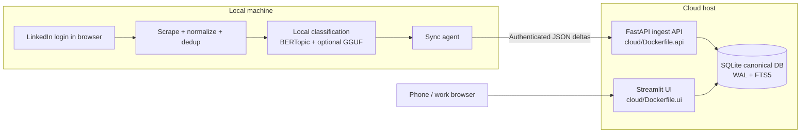

# sdd-linkedin-learning

Single-user personal knowledge library for LinkedIn Saved posts, implemented with a spec-driven workflow and optimized for low maintenance.

## What this project is

This project ingests your LinkedIn Saved posts, classifies them into stable learning topics, discovers emerging topics, and exposes a searchable web UI that you can access from desktop or mobile.

Primary objectives:

- keep LinkedIn authentication and scraping local
- keep cloud runtime simple and inexpensive
- provide broad remote access to your library through a hosted UI
- preserve privacy boundaries and reproducibility

## How it works

The system uses a hybrid architecture:

- Local machine:
	- reuses your local authenticated browser session
	- scrapes and normalizes saved posts
	- deduplicates and classifies content locally
	- sends authenticated JSON deltas to the cloud
- Cloud host:
	- runs an authenticated FastAPI ingest service
	- stores canonical SQLite data (WAL + FTS5)
	- runs Streamlit UI for remote browsing/search/review
	- performs backups and health checks

Important rule:

- no database file copy sync from local to cloud
- sync is delta-based and idempotent

## What runs where

This project has two runtime zones: your local machine and the cloud host.

### Local machine runtime (no Dockerfile required)

The local machine runs the sync and inference pipeline directly with Python:

- `local_sync/linkedin_scraper.py`: opens Playwright with your local LinkedIn session
- `local_sync/preprocessing.py`: normalization, deduplication, content hashing
- `local_sync/taxonomy_assignment.py`: stable topic assignment
- `local_sync/topic_discovery.py`: discovery candidate generation
- `local_sync/topic_label_refinement.py`: optional GGUF/llama.cpp-based label refinement
- `local_sync/sync_agent.py`: orchestrates scrape -> classify -> payload push

What this means:

- LinkedIn authentication happens only on your local machine.
- BERTopic and optional GGUF inference run locally.
- Local process sends JSON deltas to cloud API.

### Cloud runtime (containerized with Dockerfile/Podman)

The cloud host (or your local Podman stack) runs services built from these Dockerfiles:

- `cloud/Dockerfile.api` -> FastAPI ingest API (`cloud/api/*`)
- `cloud/Dockerfile.ui` -> Streamlit UI (`cloud/ui/*`)

These services are orchestrated by `cloud/docker-compose.yml` and share a persistent SQLite volume:

- API writes idempotent upserts into SQLite
- UI reads from the same live SQLite database
- backups, restore, and health checks are handled by `scripts/*`

### Runtime schema

| Zone | Main processes | Data handled | Why here |
|---|---|---|---|
| Local machine | Playwright scraper, BERTopic assignment/discovery, optional GGUF refinement, sync agent | LinkedIn session data, raw extracted content, local inference artifacts | Privacy boundary and local compute |
| Cloud host | FastAPI ingest API, Streamlit UI, SQLite canonical DB | Canonical post/topic state and review data | Remote access, persistence, low-ops hosting |


NB: If you do not see the Mermaid diagram, your current Markdown preview is likely not Mermaid-enabled.
In VS Code, open Markdown preview and ensure Mermaid support is enabled by your Markdown extension/settings.

Interpretation of the Dockerfiles:

- Dockerfiles package cloud services (API and UI).
- They do not package LinkedIn login or local inference pipeline.
- Local sync is intentionally a separate local Python runtime.
- Cloud images intentionally avoid local BERTopic/HDBSCAN dependencies, so container builds stay lightweight and do not require compiling `hdbscan`.

## Local inference vs cloud access

The design intentionally splits concerns:

- local for inference and privacy:
	- BERTopic assignment/discovery and optional local LLM label refinement run on your machine
	- LinkedIn credentials/session data never go to cloud
- cloud for broad access and operations:
	- UI is always online for phone/work-browser access
	- API and DB provide canonical state and recoverability

This keeps sensitive extraction/classification local while still giving convenient remote access to results.

## Architecture summary

- local_sync: scraping, preprocessing, classification, push
- cloud/api: auth, ingest, idempotent upserts, review APIs
- cloud/ui: Home, Inbox, Topics, Search, Review, Settings
- shared: DB layer, schemas, models, taxonomy helpers
- scripts: init, healthcheck, backup, restore, scheduling

Classification modules remain separated:

- taxonomy_assignment
- topic_discovery
- topic_label_refinement

## Feature summary (V1)

- LinkedIn Saved post local sync
- local BERTopic-based stable taxonomy assignment
- discovery candidate generation for unmatched/low-confidence content
- review actions for low-confidence and candidate decisions
- notes and FTS-backed search over title/content/summary/notes
- authenticated ingest API and authenticated UI
- SQLite persistence with backup/restore automation

## Installation and first run (local machine)

This section walks through a first end-to-end run:

1. install dependencies
2. log in to LinkedIn from local Playwright session
3. run local classification with optional GGUF label refinement
4. push deltas to cloud API (which writes into SQLite)

### 1. Install prerequisites

- Python 3.12
- Podman (for API + UI stack)
- local browser access for LinkedIn login

From repository root:

```powershell
uv venv .venv
.\.venv\Scripts\Activate.ps1
uv sync
uv run python -m playwright install chromium
```

Optional (for GGUF-based local refinement):

```powershell
uv run python -m pip install llama-cpp-python
```

### 2. Configure environment

Create local sync env file from template:

```powershell
Copy-Item .env.example .env
```

Minimum values for first cloud-connected run:

```dotenv
# Local sync
PUSH_ENABLED=true
CLOUD_API_BASE_URL=http://localhost:8000
CLOUD_INGEST_TOKEN=change-this-token
LINKEDIN_HEADLESS=false
LINKEDIN_STOP_ON_FIRST_SEEN=true
LOCAL_SYNC_FULL_RESCRAPE=false

# Optional GGUF refinement (leave empty to disable)
LLAMA_CPP_MODEL_PATH=C:/models/your-model.gguf

# Optional local embedding fallback for restricted networks
LOCAL_EMBEDDING_MODEL_PATH=C:/models/all-MiniLM-L6-v2
```

Example from your setup:

```dotenv
LOCAL_EMBEDDING_MODEL_PATH=C:/Users/mbottari/.models/all-MiniLM-L6-v2_model.safetensors
```

If your model is in a custom location, put that absolute path in the same env file passed to `from_env(...)`.
Example for your setup:

```dotenv
LLAMA_CPP_MODEL_PATH=C:/Users/my_user/.models/Llama-3.2-1B-Instruct-Q4_K_S.gguf
```

Notes:

- `CLOUD_INGEST_TOKEN` must match `INGEST_API_TOKEN` in `cloud/.env`.
- Keep `LINKEDIN_HEADLESS=false` for first login so you can complete auth manually.
- `LLAMA_CPP_MODEL_PATH` is loaded from whichever file you pass to `LocalSyncConfig.from_env(...)`.
	In this README commands, that file is `cloud/.env`.
- Incremental scraping is enabled by default (`LINKEDIN_STOP_ON_FIRST_SEEN=true`) so sync stops when the first already-synced post appears.
- To force a full scrape/reprocess (useful while developing extraction changes), set `LOCAL_SYNC_FULL_RESCRAPE=true`.
- Use `LINKEDIN_STOP_ON_FIRST_SEEN=true` for routine incremental runs.
- Use `LOCAL_SYNC_FULL_RESCRAPE=true` only for explicit full backfill/debug runs.

### 3. Start cloud API + UI (Podman)

```powershell
cd cloud
# Compatibility fallback: some compose providers ignore bind.create_host_path.
$dataDir = ((Get-Content .env | Where-Object { $_ -match '^DATA_DIR=' } | Select-Object -First 1).Split('=',2)[1]).Trim()
New-Item -ItemType Directory -Force $dataDir | Out-Null
podman compose --env-file .env up -d --build
cd ..
```

Verify API health:

```powershell
$token = (Get-Content cloud/.env | Select-String '^INGEST_API_TOKEN=').ToString().Split('=')[1]
Invoke-RestMethod -Headers @{ Authorization = "Bearer $token" } http://localhost:8000/health
```

### 4. First LinkedIn login and local sync/classification run

Run one sync cycle from repository root:

```powershell
uv run python -c "from local_sync.config import LocalSyncConfig; from local_sync.sync_agent import SyncAgent; import json; result=SyncAgent(LocalSyncConfig.from_env('cloud/.env')).run_once(limit=100); print(json.dumps(result, indent=2))"
```

Note: run this from repository root (`sdd-linkedin-learning`) so local source modules are imported.

Expected behavior:

- a Chromium window opens to LinkedIn Saved Posts
- if login is required, complete login/MFA in that browser
- return to terminal and press Enter when prompted
- normalization, dedup, classification, discovery, export, and push are executed

### 5. Verify data reached cloud SQLite

Check sync status:

```powershell
Invoke-RestMethod -Headers @{ Authorization = "Bearer $token" } http://localhost:8000/sync-status
```

Open UI:

- URL: `http://localhost:8501`
- sign in with `UI_ACCESS_PASSWORD` from `cloud/.env`
- verify posts appear in Home/Inbox/Search

### 6. Optional manual backlog reprocess

```powershell
uv run python -c "from local_sync.config import LocalSyncConfig; from local_sync.sync_agent import SyncAgent; import json; result=SyncAgent(LocalSyncConfig.from_env('cloud/.env')).manual_reprocess_backlog(limit=500); print(json.dumps(result, indent=2))"
```

### 7. Troubleshooting first run

- If push fails with auth error, confirm token parity between `.env` and `cloud/.env`.
- If push fails with connection error, verify API is running on port 8000.
- If zero posts are extracted, relaunch with `LINKEDIN_HEADLESS=false`, confirm LinkedIn Saved page access, and rerun.
- If LinkedIn redirects to checkpoint/challenge and Playwright reports interrupted navigation, complete verification in the opened browser and press Enter; the scraper now retries saved-posts navigation after auth.
- If GGUF refinement is not used, verify `LLAMA_CPP_MODEL_PATH` points to an existing `.gguf` and `llama-cpp-python` is installed.
- If Playwright browser download fails with TLS/certificate errors, the scraper now falls back to installed Chrome, then Microsoft Edge channel automatically.
- If embedding model download fails with TLS/certificate errors (`CERTIFICATE_VERIFY_FAILED` from huggingface.co), use one of these local sync options:
	- set `LOCAL_SYNC_DISABLE_BERTOPIC=true` to skip BERTopic embedding downloads and use deterministic keyword fallback only
	- or set `LOCAL_SYNC_EMBEDDINGS_LOCAL_ONLY=true` to use only local Hugging Face cache for `sentence-transformers/all-MiniLM-L6-v2` (no network calls)
	- if you use local-only mode, pre-warm cache once on a trusted network: `uv run python -c "from sentence_transformers import SentenceTransformer; SentenceTransformer('sentence-transformers/all-MiniLM-L6-v2')"`
- If needed, set an explicit browser executable path before running sync:

```powershell
$env:PLAYWRIGHT_CHROMIUM_EXECUTABLE_PATH = "C:\Program Files\Google\Chrome\Application\chrome.exe"
# Example Edge path:
# $env:PLAYWRIGHT_CHROMIUM_EXECUTABLE_PATH = "C:\Program Files (x86)\Microsoft\Edge\Application\msedge.exe"
```

- If BERTopic embedding download fails with SSL/certificate trust errors, configure trusted corporate CA/proxy settings or set a valid `LOCAL_EMBEDDING_MODEL_PATH`.
- If `LOCAL_EMBEDDING_MODEL_PATH` is set but invalid/unreadable, sync fails with explicit path validation guidance.
- If using a local `.safetensors` artifact (for example `C:/Users/my_user/.models/all-MiniLM-L6-v2_model.safetensors`), set `LOCAL_EMBEDDING_MODEL_PATH` to that absolute path in the env file used by the run.

## Deployment (Podman on local machine)

These commands run API + UI using Podman Compose.

### 1. Prerequisites

- Podman installed and running
- Podman compose provider available (`podman compose`)

Check:

```powershell
podman --version
podman compose version
```

### 2. Create runtime environment file

From repository root:

```powershell
Copy-Item cloud/.env.example cloud/.env
```

Edit `cloud/.env` and set:

- `INGEST_API_TOKEN`
- `UI_ACCESS_PASSWORD`
- `DATA_DIR` (for local dev, use a local persistent folder)
- `CLOUD_DB_PATH=/data/library.db` (required so DB writes go to mounted `/data` volume)

Example:

```dotenv
INGEST_API_TOKEN=change-this-token
UI_ACCESS_PASSWORD=change-this-password
CLOUD_DB_PATH=/data/library.db
API_PORT=8000
UI_PORT=8501
DATA_DIR=../.state/podman-data
```

### 3. Start services

```powershell
cd cloud
# Compatibility fallback: some compose providers ignore bind.create_host_path.
$dataDir = ((Get-Content .env | Where-Object { $_ -match '^DATA_DIR=' } | Select-Object -First 1).Split('=',2)[1]).Trim()
New-Item -ItemType Directory -Force $dataDir | Out-Null
podman compose --env-file .env up -d --build
```

### 4. Validate runtime

```powershell
podman compose ps
podman compose logs -f api
podman compose logs -f ui
```

### 5. Check health endpoints

```powershell
$token = (Get-Content .env | Select-String '^INGEST_API_TOKEN=').ToString().Split('=')[1]
Invoke-RestMethod -Headers @{ Authorization = "Bearer $token" } http://localhost:8000/health
Invoke-WebRequest http://localhost:8501/_stcore/health
```

### 6. Backup and restore

From repository root, backup:

```powershell
uv run python scripts/backup_db.py --db-path .state/podman-data/library.db --backup-dir .state/backups --label library --keep 14
```

Restore drill (stop services first):

```powershell
cd cloud
podman compose down
cd ..
bash scripts/restore_db.sh .state/backups/library-YYYYMMDDTHHMMSSZ.sqlite .state/podman-data/library.db --force
cd cloud
podman compose up -d
```

## Deployment on EC2

For EC2 bootstrap with Parameter Store integration, see:

- `cloud/bootstrap/ec2_user_data.sh`
- `docs/deployment.md`

For this repository's deployment flows, see `DEPLOYMENT.md`:

- Phase 6 validation/testing deployment: `scripts/deploy_phase6.sh` and `scripts/deploy_phase6.ps1`
- Real EC2 API/UI deployment runtime: `scripts/deploy_cloud_ec2.sh` (run this inside the EC2 instance)
- Faster Phase 6 US2 test run example: `./scripts/deploy_phase6.sh --include-us2 --test-e2e-sample-limit 10 --test-force-full-rescrape`

Quick EC2 runtime command:

```bash
chmod +x scripts/deploy_cloud_ec2.sh
./scripts/deploy_cloud_ec2.sh up
```

## Inference-Only Debug (No Deploy/Push/Scrape)

To debug taxonomy assignment + discovery embedding behavior without running the full Phase 6 pipeline, use:

```powershell
uv run --no-sync python scripts/run_inference_debug.py --limit 10 --print-candidates
```

Notes:
- This reads posts from the latest `exports/batch_*.json` file (or pass `--input-export <path>`).
- It does not deploy containers, scrape LinkedIn, or push to API.

## Governance

Engineering and product principles are defined in:

- `.specify/memory/constitution.md`

All specs, plans, tasks, and implementation changes must comply with the constitution.

## Spec Kit with Codex

After installing Spec Kit, initialize Codex-compatible skills:

```bash
specify init . --ai codex --ai-skills
```


